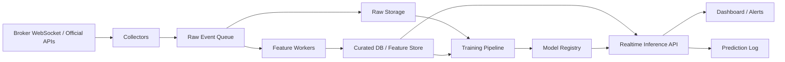

# System Architecture

## 1. 설계 원칙

1. 실시간 수집과 배치 학습을 분리합니다.
2. 원본 데이터와 가공 데이터를 분리 저장합니다.
3. 예측 결과는 반드시 입력 특징과 함께 로그로 남깁니다.
4. 실험용 코드와 운영용 수집기를 점진적으로 분리합니다.

## 2. 상위 구조



## 3. 컴포넌트 설명

### Collectors

- 증권사 WebSocket, 공시 API, 뉴스/검색 API에서 데이터를 수집합니다.
- 각 수집기는 소스별 장애와 인증 만료를 독립적으로 처리해야 합니다.

### Raw Event Queue

- 실시간 이벤트를 표준 스키마로 밀어 넣는 버퍼 계층입니다.
- 초기에 트래픽이 크지 않다면 단순 비동기 큐로 시작하고, 이후 Kafka/Redpanda로 확장할 수 있습니다.

### Raw Storage

- 재현성과 디버깅을 위해 원본 이벤트를 그대로 보관합니다.
- 모델 오류가 생겼을 때 이벤트 재생이 가능해야 합니다.

### Curated DB / Feature Store

- 종목, 시세 바, 공시 이벤트, 뉴스 메타, 감성 점수, 관심도 지표를 정규화해 저장합니다.
- 모델 학습과 실시간 추론이 공통으로 참조하는 계층입니다.

### Training Pipeline

- 일봉/분봉/이벤트 데이터를 병합하여 학습셋을 만듭니다.
- 워크포워드 검증, 피처 중요도 계산, 모델 버전 관리를 수행합니다.

### Realtime Inference API

- 최신 특징을 읽어 종목별 예측을 생성합니다.
- 예측 점수, 신뢰도, 상위 근거 신호를 함께 반환합니다.

### Dashboard / Alerts

- 연구용 화면에서 종목 상태, 이벤트, 예측 히스토리를 보여줍니다.
- 특정 조건에서 알림을 발생시킵니다.

## 4. 권장 기술 스택

| 영역 | 권장안 |
| --- | --- |
| 수집/백엔드 | Python, FastAPI, asyncio |
| 데이터 처리 | pandas 또는 polars |
| DB | PostgreSQL + TimescaleDB |
| 캐시 | Redis |
| 메시지 브로커 | 초기에는 경량 큐, 이후 Kafka/Redpanda 검토 |
| 모델 | LightGBM/XGBoost + PyTorch |
| 대시보드 | 초기 연구용은 Streamlit 또는 FastAPI + 간단한 웹 UI |
| 스케줄링 | APScheduler, cron, Airflow 중 규모에 맞춰 선택 |

## 5. 권장 디렉터리 구조

```text
app/
  collectors/
  features/
  models/
  services/
  api/
data/
  raw/
  curated/
docs/
tests/
scripts/
```

## 6. 운영 관점 체크리스트

- 장중 재연결과 인증키 갱신 처리
- API 호출량 모니터링
- 수집 지연과 결측 감지
- 모델 버전별 성과 로그
- 예측 결과와 실제 결과의 사후 비교

## 7. 아키텍처 단계별 진화

### 1단계

- 단일 프로세스 수집기
- PostgreSQL 중심 저장
- 수동 또는 일 배치 학습

### 2단계

- 스트리밍 큐 도입
- 특징 계산기 분리
- 실시간 추론 API 운영

### 3단계

- 멀티모달 모델 확장
- 온라인 재보정
- 운영 모니터링 자동화
