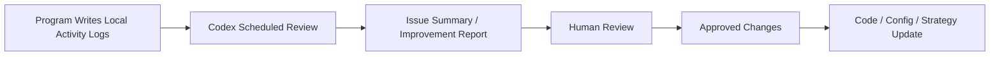

# Codex Augmentation Plan

## 1. 목적

이 문서는 Codex를 이 프로젝트의 `지속 개선 보조 에이전트`로 활용하는 방식을 정의합니다.

목표:

1. 프로그램이 남긴 활동 기록을 바탕으로 문제점과 개선점을 정기 점검
2. 머신러닝 성능 저하, 데이터 품질 문제, 전략 이상 동작을 자동으로 검토
3. 사람이 매번 직접 로그를 뒤지지 않아도 개선 루프를 지속

## 2. 공식 OpenAI 문서 기준 판단

`2026-04-11` 기준 OpenAI 공식 문서에서 확인되는 점은 아래와 같습니다.

1. Codex는 ChatGPT `Plus`, `Pro`, `Business`, `Enterprise/Edu` 플랜에 포함된다고 안내됩니다.
2. Codex CLI는 `Sign in with ChatGPT` 흐름을 지원합니다.
3. Codex app은 `automations` 기능을 제공한다고 안내됩니다.
4. Codex는 SDK를 통해 programmatic control이 가능하다고 안내됩니다.
5. 다만 `ChatGPT에서의 Codex 사용`과 `API/SDK 사용`은 별도 비용/가용성 체계로 봐야 합니다.

즉, 두 가지 방식이 가능합니다.

### 방식 A. Codex CLI / Codex app 기반 외부 보조

- 사용자가 ChatGPT 유료 플랜으로 Codex에 로그인
- Codex가 로컬 프로젝트와 활동 로그 폴더를 읽음
- 정해진 주기마다 점검 리포트 생성

장점:

- 가장 빠르게 시작 가능
- 별도 앱 내 OpenAI 호출 코드가 없어도 됨

### 방식 B. 프로그램 내부 OpenAI API / SDK 연동

- 프로그램이 직접 OpenAI API 또는 Codex SDK를 사용
- 로그 분석, 리포트 작성, 자동 분류 등을 자체 기능으로 수행

장점:

- 완전 자동화 가능
- 앱 내부 기능으로 묶기 쉬움

주의:

- 이 방식은 일반적으로 `API 사용` 관점으로 설계하는 것이 안전합니다.
- ChatGPT 구독 포함 여부와 앱 내부 API 호출 비용은 같은 개념으로 보면 안 됩니다.

## 3. 현재 프로젝트에 가장 적합한 방식

현재 단계에서는 아래 순서가 가장 적절합니다.

### 1단계

- `방식 A` 사용
- 프로그램은 로컬 활동 폴더에 기록만 남김
- Codex app 또는 Codex CLI가 주기적으로 해당 폴더를 읽고 리뷰

### 2단계

- 필요하면 일부 분석 기능만 `방식 B`로 앱 내부에 편입
- 예: 로그 요약, 오류 분류, 리포트 초안 생성

현재 프로젝트에서는 `외부 보조형 Codex 루프`가 가장 현실적입니다.

## 4. Codex가 도울 수 있는 영역

### A. 머신러닝 개선

- 최근 실험 성능 비교
- feature importance 변화 검토
- 실패 구간 분석
- drift 징후 탐지
- 라벨/특징 설계 개선 제안

### B. 운영 안정성 점검

- 데이터 지연/결측 검토
- WebSocket 재연결 실패 패턴 분석
- reconciliation mismatch 원인 분석
- replay/live 차이 검토

### C. 전략 검증 보조

- 손실 거래 패턴 요약
- 시간대별 실패 원인 분석
- 진입/청산 규칙 튜닝 제안
- paper 성과 리포트 요약

### D. 개발 생산성 보조

- 에러 로그 기반 수정 포인트 제안
- 테스트 누락 검토
- 문서/리포트 자동 작성
- TODO 추출 및 우선순위화

## 5. Codex에게 맡기지 않는 영역

초기 기준으로 아래는 Codex가 자동으로 하지 않도록 두는 것이 맞습니다.

1. 실전 주문 실행
2. 실전 키 변경
3. 모델 자동 배포
4. 사람이 검토하지 않은 전략 파라미터 강제 변경
5. 활동 로그 임의 삭제

## 6. 권장 Codex 개선 루프

중요:

- Codex는 기본적으로 `검토와 제안` 역할
- 실제 적용은 사람 승인 또는 별도 승인 파이프라인을 거침

## 7. 추천 운영 모드

현재 프로젝트에는 아래 3개 Codex 모드를 두는 것이 좋습니다.

### Mode 1. Intraday Monitor Review

- 장중 로그 이상 여부 확인
- 데이터 지연, 주문 차단, mismatch 점검

### Mode 2. End-of-Day Improvement Review

- 당일 예측/주문/성과 요약
- 실패 패턴과 개선점 정리

### Mode 3. Weekly ML Review

- 최근 실험, feature, 전략 성과 비교
- 다음 실험 우선순위 제안

## 8. 권장 출력물

Codex는 아래 파일을 남기도록 설계하는 것이 좋습니다.

- `reports/codex/intraday/*.md`
- `reports/codex/eod/*.md`
- `reports/codex/weekly/*.md`
- `reports/codex/action-items/*.json`

## 9. 현재 프로젝트 기준 추천안

현재는 아래 기준으로 채택하는 것이 적합합니다.

1. 프로그램은 지정된 로컬 폴더에 활동 기록 저장
2. Codex는 정해진 주기마다 그 폴더를 읽고 검토
3. Codex는 `리포트/개선 제안`까지만 자동 수행
4. 실제 코드 수정이나 전략 변경은 사람 승인 후 진행

## 10. 나중에 확장 가능한 방향

1. Codex app automation으로 정기 검토 자동화
2. Codex SDK/API 기반 앱 내부 분석 모듈
3. PR 자동 생성 또는 patch 초안 생성
4. 실험 결과 기반 feature backlog 자동 관리

## 11. 참고 링크

- OpenAI Help: Using Codex with your ChatGPT plan: <https://help.openai.com/en/articles/11369540-using-codex-with-your-chatgpt-plan>
- OpenAI Help: Codex CLI and Sign in with ChatGPT: <https://help.openai.com/en/articles/11381614>
- OpenAI Developers: Codex use cases: <https://developers.openai.com/codex/use-cases>
- OpenAI Developers: Codex / API model docs: <https://developers.openai.com/api/docs/models/gpt-5.3-codex>
