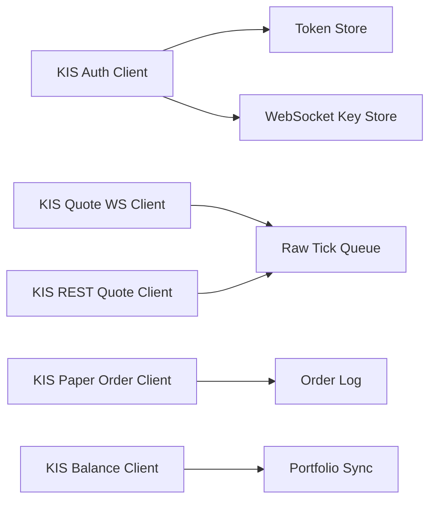

# KIS Integration Plan

## 1. 목적

이 문서는 한국투자 Open API를 프로젝트에 어떻게 연결할지 정리합니다.

현재 전제:

- 사용자는 `실전투자계좌용 API`와 `모의투자계좌용 API`를 이미 확보했습니다.
- 개발 초기 목표는 `실시간 시세 수집 + 자동 모의투자 검증`입니다.
- 실전 주문은 당분간 사용하지 않습니다.

## 2. 공식 문서 기준 핵심 포인트

한국투자 Open API 공식 문서 기준으로 현재 확인되는 핵심은 다음과 같습니다.

1. REST 호출은 `접근토큰` 기반입니다.
2. WebSocket 실시간 수신은 별도의 `실시간 접속키` 발급 흐름이 있습니다.
3. `Hashkey` 항목이 별도로 제공되어 주문성 요청 무결성 처리에 대비할 수 있습니다.
4. 공식 문서에는 `국내주식 주문/계좌`, `기본시세`, `실시간시세` API군이 분리되어 있습니다.
5. 개발자센터 공지에는 `2026-01-15` 웹소켓 무한 재연결 자동 차단 공지, `2026-03-20` 신규 고객 초당 호출 제한 안내가 보입니다.

즉, 이 프로젝트는 처음부터 `재연결 절제`, `호출량 관리`, `REST/WebSocket 분리`를 설계에 넣어야 합니다.

## 3. 공식 문서 기준 환경 구분

공식 문서상 확인되는 환경 구분은 아래와 같습니다.

### 운영

- `https://openapi.koreainvestment.com:9443`

### 개발

- `http://210.107.75.78:9443`

### 개발 WebSocket

- `ws://210.107.75.79:21000`

현재 문서상으로는 개발 환경을 먼저 맞춘 뒤 운영으로 전환하는 것을 권장하고 있습니다.

## 4. 현재 프로젝트에서 필요한 API 그룹

### 반드시 필요한 그룹

- OAuth 인증
- 실시간 WebSocket 접속키 발급
- 국내주식 실시간시세
- 국내주식 기본시세
- 국내주식 주문/계좌

### 초기에 우선 구현할 기능

1. 토큰 발급/갱신
2. WebSocket 접속키 발급
3. 실시간 체결/호가 수신
4. 분봉/현재가 보조 조회
5. 모의주문 생성
6. 잔고/주문체결 조회

## 5. 프로젝트 내부 연동 구조

권장 구조는 아래와 같습니다.

핵심 분리:

- 인증 클라이언트
- 시세 REST 클라이언트
- 시세 WebSocket 클라이언트
- 모의주문 클라이언트
- 잔고/체결 조회 클라이언트

## 6. 인증 흐름

### REST 토큰

현재 공식 문서에서는 `POST /oauth2/tokenP`를 통해 접근토큰을 발급하는 흐름이 확인됩니다.

확인된 포인트:

- 접근토큰 유효시간은 공식 문서 예시 기준 `90일`
- 갱신토큰도 별도로 제공
- 토큰 폐기 API도 제공

### WebSocket 접속키

실시간 시세는 REST 접근토큰과 별도로 `실시간 (웹소켓) 접속키 발급` 흐름이 존재합니다.

따라서 구현도 분리해야 합니다.

1. 앱 시작 시 REST 토큰 확인
2. WebSocket 시작 전 접속키 발급
3. 만료 또는 연결 종료 시 접속키 재발급 정책 적용

## 7. 시세 수집 전략

### WebSocket 담당

- 실시간 체결
- 실시간 호가
- 장 운영 상태

### REST 담당

- 초기 종목 정보 로드
- 분봉 백필
- 현재가 보정 조회
- 장애 시 보조 확인

이 구조가 필요한 이유:

1. WebSocket은 실시간성에 강함
2. REST는 기준정보와 보정에 유리함
3. 장애 시 복구 루틴을 만들기 쉬움

## 8. 주문 연동 전략

### Paper Order Client

- 모의주문 전용
- 주문 생성
- 정정/취소
- 주문 상태 조회
- 체결 확인

### Live Client

- 당분간 조회 전용
- 주문 함수는 구현하더라도 연결하지 않음

## 9. 호출 제한과 재연결 정책

공식 공지상 호출 제한과 WebSocket 무한 연결 차단 이슈가 있기 때문에 아래 기준이 필요합니다.

### REST

- 종목별 폴링 최소화
- 우선순위 종목만 조회
- 지표 계산용 데이터는 내부 캐시 재사용

### WebSocket

- 무한 루프 재연결 금지
- 지수적 백오프 적용
- 연속 실패 횟수 제한
- 실패 시 `risk_event` 기록

### 권장 백오프 예시

- 1회 실패: 3초
- 2회 실패: 10초
- 3회 실패: 30초
- 이후: 60초 이상

## 10. 초기 구현 우선순위

1. 인증 클라이언트
2. 실시간 체결 WebSocket
3. 실시간 호가 WebSocket
4. 분봉/현재가 REST 보조 조회
5. 모의주문 REST
6. 잔고/체결 조회

## 11. 개발 시 주의사항

1. REST와 WebSocket 인증 상태를 따로 관리합니다.
2. paper와 live의 키/계좌/도메인을 절대 혼용하지 않습니다.
3. TR ID와 엔드포인트는 코드 하드코딩보다 설정 테이블 또는 상수 모듈로 분리합니다.
4. 재연결 실패, 토큰 만료, 응답 오류는 모두 운영 로그에 남깁니다.

## 12. 이 문서의 역할

이 문서는 한국투자 API를 단순 “사용 가능” 상태에서, 실제 프로젝트 내 서비스 구조로 바꾸는 기준선입니다.

다음 개발 단계에서는 이 문서를 기준으로:

- `app/brokers/kis_auth.py`
- `app/brokers/kis_quote_ws.py`
- `app/brokers/kis_quote_rest.py`
- `app/brokers/kis_paper_order.py`

같은 모듈로 바로 연결할 수 있습니다.
