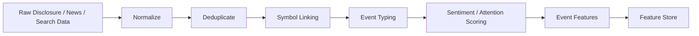

# NLP Event Pipeline

## 1. 목적

이 문서는 뉴스, 공시, 검색 반응 데이터를 모델 입력용 이벤트 특징으로 바꾸는 과정을 정의합니다.

핵심 목적:

1. 텍스트를 단순 저장하지 않고 구조화된 이벤트로 변환
2. 종목과 정확히 연결
3. 중복 기사와 노이즈를 줄임
4. 실시간 특징 계산에 바로 사용할 수 있게 함

## 2. 초기 범위

초기 버전에서는 아래 범위만 사용합니다.

- 공시 제목
- 뉴스 제목
- 뉴스 요약
- 검색 반응 메타데이터

초기에는 기사 본문 전체나 대규모 언어모델 기반 해석보다, `제목/요약 기반 경량 파이프라인`이 더 적합합니다.

## 3. 전체 흐름

## 4. 단계별 처리

### Normalize

- HTML 태그/엔티티 정리
- 공백/특수문자 정규화
- 제목/요약 길이 제한
- 게시시각과 수집시각 분리 저장

### Deduplicate

초기 규칙:

1. 정규화된 제목이 같고
2. 발행 시각이 매우 가깝고
3. URL 또는 공급사가 같으면

중복 후보로 봅니다.

### Symbol Linking

초기 연결 방법:

1. 공식 종목명 정확 일치
2. 등록된 종목 별칭 사전
3. 티커/약칭 패턴
4. 공시 메타데이터 직접 연결

출력:

- `symbol`
- `link_confidence`
- `link_method`

### Event Typing

초기 이벤트 유형 예시:

- 공시: earnings, guidance, contract, capital, shareholder, halt, resume
- 뉴스: earnings, product, regulation, theme, macro, rumor
- 반응: search_spike, reaction_spike

### Sentiment / Attention Scoring

초기 접근:

- 룰 기반 감성 점수
- 주의집중 점수
- 악재/호재 키워드 사전
- 공시/뉴스 유형별 가중치

## 5. 종목 연결 정책

### high confidence

- 공시 메타에 종목코드가 직접 있음
- 공식 종목명이 제목에 명확히 존재

### medium confidence

- 등록 별칭 또는 약칭으로 연결

### low confidence

- 테마 키워드만 존재
- 종목 연결이 애매함

현재 기준:

- `high`, `medium`만 기본 특징에 반영
- `low`는 별도 관찰용 저장

## 6. 초기 감성/주의집중 특징

초기에는 아래 정도면 충분합니다.

- 최근 15분 뉴스 수
- 최근 60분 뉴스 수
- 최근 60분 공시 수
- 최근 15분 긍정 이벤트 수
- 최근 15분 부정 이벤트 수
- 최근 15분 attention score
- 최근 60분 attention score

## 7. 품질 지표

- 종목 연결 성공률
- low-confidence 연결 비율
- 중복 기사 제거율
- 이벤트 분류 실패율
- 게시시각 누락 비율

## 8. 초기 구현 우선순위

1. 정규화
2. 중복 제거
3. 종목 연결
4. 이벤트 유형 분류
5. 감성/주의집중 점수
6. 특징 집계

## 9. 현재 작업 기준안

- 제목/요약 기반
- 룰 기반 분류/감성
- 종목 연결 신뢰도 관리
- 15분/60분 집계 특징 생성
