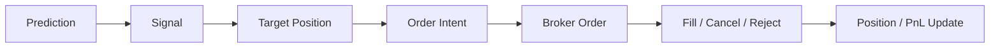

# Order Lifecycle

## 1. 목적

이 문서는 `예측 -> 신호 -> 주문 -> 체결 -> 포지션 반영 -> 복구`까지의 상태 변화를 정의합니다.

주문 생명주기를 분명히 해야 하는 이유:

1. 재시작 후 중복 주문을 막을 수 있습니다.
2. 응답 누락이나 지연을 안전하게 처리할 수 있습니다.
3. paper와 live 인터페이스를 같은 구조로 맞출 수 있습니다.

## 2. 기본 원칙

1. 모든 주문은 `signal_id`에서 출발합니다.
2. 모든 주문은 고유한 `client_order_id`를 가집니다.
3. 상태 전이는 명시적으로만 일어납니다.
4. 같은 `client_order_id`로 중복 생성하지 않습니다.

## 3. 상위 흐름

## 4. 주문 전 단계

주문 전에는 아래 단계가 있습니다.

### Signal

- 전략 규칙을 통과한 매수 후보

### Target Position

- 계좌 기준 최종 목표 수량 또는 목표 비중

### Order Intent

- 실제 주문으로 바꾸기 직전의 실행 의도
- side, qty, price policy, reason 포함

이 세 단계가 분리되어 있어야 어디서 문제가 생겼는지 추적 가능합니다.

## 5. 주문 상태 머신

초기 권장 상태는 아래와 같습니다.

- `created`
- `queued`
- `sent`
- `acknowledged`
- `partially_filled`
- `filled`
- `cancel_requested`
- `cancelled`
- `rejected`
- `expired`
- `recovery_pending`

## 6. 상태 의미

### created

- 내부에서 주문 객체 생성 완료

### queued

- 전송 대기 중

### sent

- 브로커로 전송 요청 완료

### acknowledged

- 브로커가 주문을 정상 접수

### partially_filled

- 일부 수량 체결

### filled

- 전량 체결 완료

### cancel_requested

- 취소 요청 전송

### cancelled

- 취소 확정

### rejected

- 브로커 또는 내부 리스크 규칙에 의해 거절

### expired

- 유효시간 만료 또는 장 마감으로 종료

### recovery_pending

- 재시작 또는 응답 누락으로 상태 재동기화 필요

## 7. 주문 멱등성 Idempotency

초기 구현에서 가장 중요한 장치 중 하나입니다.

### 기본 규칙

- 하나의 `order_intent`는 하나의 `client_order_id`만 가짐
- 같은 `client_order_id`는 중복 전송하지 않음
- 재시작 시에도 이미 존재하는 `client_order_id`는 재사용하지 않음

### 권장 구성 요소

`client_order_id`에 아래를 포함하는 방식이 좋습니다.

- trade_date
- symbol
- strategy_version
- signal_id 또는 intent_id

## 8. 부분 체결 정책

초기 버전에서는 부분 체결을 최대한 단순하게 처리합니다.

1. 부분 체결 발생 시 상태를 `partially_filled`로 변경
2. 체결 수량만큼 포지션 반영
3. 남은 수량은 유지 또는 취소 정책 적용

초기 paper 엔진에서는 전량 체결을 기본 가정으로 시작할 수 있지만, 상태 구조는 미리 준비해야 합니다.

## 9. 취소/정정 정책

초기 기준은 아래 정도로 충분합니다.

### 취소 대상

- 유효시간이 지난 지정가 주문
- 장 마감 인접 시 미체결 주문
- 신호가 반전된 주문

### 초기 정책

- 지정가 미체결은 일정 시간 후 취소
- 시장가성 주문은 취소보다 체결 가정 중심

## 10. 장중 복구 정책

장중 재시작이나 응답 누락이 생기면 아래 순서로 복구합니다.

1. 브로커 미체결 주문 조회
2. 브로커 체결 내역 조회
3. 내부 주문 상태와 비교
4. 모르는 주문은 `recovery_pending`
5. 차이 해결 후 정상 상태로 복귀

## 11. 주문 이벤트 로그

주문은 최종 상태만 저장하면 부족합니다. 상태 전이도 남겨야 합니다.

최소 이벤트 예시:

- created
- sent
- acknowledged
- partially_filled
- filled
- cancel_requested
- cancelled
- rejected
- recovered

## 12. 초기 구현 우선순위

1. `created -> sent -> filled/rejected` 단순 흐름
2. `client_order_id` 기반 멱등성
3. 재시작 시 `recovery_pending`
4. 이후 부분 체결/취소/정정 확장

## 13. 현재 구조에 필요한 추가 모듈

- `order_intent builder`
- `execution gateway`
- `order state reducer`
- `recovery resolver`
- `order event logger`

## 14. 체크리스트

1. 주문 객체와 상태 전이 로그를 분리하기
2. signal과 order를 1:1로 고정하지 않기
3. 포지션 반영은 체결 기준으로만 하기
4. 재시작 시 미체결/체결을 먼저 동기화하기
