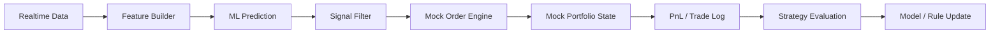

# Paper Trading Validation Plan

## 1. 목적

이 프로젝트는 머신러닝 예측을 단순 지표로 끝내지 않고, `예측 결과를 기반으로 자동 모의투자`를 수행해 실전성과 운영 가능성을 함께 검증합니다.

즉, 검증은 3단계로 나뉩니다.

1. 오프라인 백테스트
2. 실시간 예측 검증
3. 자동 모의주문 기반 전술 검증

## 2. 현재 상태

사용자는 이미 `한국투자증권 실전투자계좌용 API`와 `모의투자계좌용 API`를 확보한 상태입니다.

이 점은 매우 중요합니다. 데이터 수집과 주문 검증을 동일 브로커 생태계에서 맞출 수 있기 때문입니다.

다만 초기 개발 원칙은 아래와 같이 두는 것이 안전합니다.

1. 주문 자동화는 `모의투자계좌`에서만 활성화
2. 실전투자계좌 API는 조회/확장용으로만 보관
3. 기본 설정은 항상 실전 주문 비활성화

## 3. 전체 검증 루프

## 4. 예측과 주문은 분리해야 한다

머신러닝 모델이 내는 값은 `예측`입니다. 주문은 별도의 `신호 정책`과 `리스크 규칙`을 거쳐야 합니다.

즉:

- 모델: 상승/하락/중립 확률을 예측
- 전략 레이어: 어떤 경우에 매수/매도/관망할지 결정
- 주문 엔진: 모의주문 실행

이 분리를 하지 않으면 모델 성능과 전략 성능을 구분할 수 없습니다.

## 5. 초기 주문 신호 정책 권장안

초기에는 복잡한 포트폴리오 전략보다 단순한 규칙이 좋습니다.

### 매수 진입 예시

- 15분 상승 확률이 특정 임계값 이상
- 60분도 중립 이상
- 신뢰도 기준 통과
- 최근 공시/뉴스에 극단적 악재 없음
- 스프레드와 호가 상태가 허용 범위 내

### 청산 예시

- 목표 수익 도달
- 손절 조건 도달
- 예측 신호 반전
- 장 종료 전 정리

### 관망 예시

- 상승 확률은 높지만 신뢰도가 낮음
- 중립 확률이 너무 큼
- 이벤트 발생 직후 변동성이 비정상적으로 큼

## 6. 리스크 통제 규칙

자동 모의주문에서도 리스크 통제가 반드시 필요합니다.

### 포지션 규칙

- 종목당 최대 보유 비중 제한
- 동시 보유 종목 수 제한
- 동일 테마 과집중 제한

### 주문 규칙

- 시장가 남발 금지
- 스프레드 과대 시 주문 금지
- 특정 시간대 주문 제한

### 손익 규칙

- 일일 최대 손실 제한
- 종목별 최대 손실 제한
- 연속 손실 시 자동 중단

### 시스템 규칙

- 데이터 지연 시 주문 금지
- 모델 추론 실패 시 주문 금지
- API 장애 시 즉시 중단

## 7. 자동 모의투자 검증에서 꼭 저장할 로그

### 예측 로그

- 예측 시각
- 종목
- horizon
- 확률 값
- 신뢰도
- 근거 특징

### 신호 로그

- 주문 여부
- 주문 생성 이유
- 주문 차단 이유

### 주문 로그

- 주문 시각
- 주문 종류
- 주문 가격
- 체결 가격
- 체결 수량

### 포트폴리오 로그

- 보유 종목
- 평균 단가
- 미실현 손익
- 실현 손익

## 8. 자동 모의투자의 핵심 검증 질문

1. 예측 정확도가 실제 매매 성과로 이어지는가
2. 어떤 신호 정책이 노이즈를 가장 잘 걸러내는가
3. 거래비용과 슬리피지를 반영해도 유효한가
4. 특정 장세에서만 성과가 나는가
5. 예측은 좋아도 주문 정책이 나빠서 손실이 나는가

## 9. 평가 지표

### 모델 지표

- balanced accuracy
- PR-AUC
- calibration

### 전략 지표

- 승률
- 평균 손익비
- 기대값
- 최대 낙폭
- 일별 손익 변동성
- 회전율

### 운영 지표

- 주문 실패율
- 주문 차단율
- 신호 대비 체결률
- 데이터 지연 중 주문 발생 여부

## 10. 단계별 개발 권장 순서

### 1단계

- 예측만 생성
- 주문은 생성하지 않고 가상 신호만 기록

### 2단계

- 모의주문 생성
- 체결/포트폴리오 로그 기록

### 3단계

- 리스크 규칙 자동화
- 전략 파라미터 비교

### 4단계

- 모의투자 기반 챔피언/챌린저 비교

## 11. 실전투자계좌 API의 위치

이미 실전 API도 확보하셨지만, 현재 프로젝트 단계에서는 아래처럼 두는 것이 좋습니다.

- 지금: 실전 계좌 조회/잔고 구조 확인용
- 이후: 실전 전환 시 인터페이스 호환 검증용
- 당분간: 주문 기능은 완전히 비활성화

## 12. 지금 전체 기획에서 추가로 구체화된 부분

이전까지는 예측 품질 검증이 주로 `백테스트` 중심이었습니다. 이번에 아래가 더 명확해졌습니다.

1. 예측과 주문 정책은 분리한다.
2. 모의투자 자동화는 모델 검증 루프의 일부로 본다.
3. 모델 성공 기준에는 모의투자 성과도 포함한다.
4. 실전 API는 확보했더라도 당분간 실주문은 막는다.
