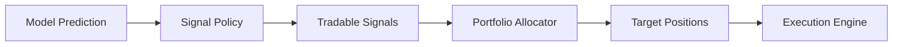

# Portfolio And Reconciliation

## 1. 목적

이 문서는 `예측 -> 신호 -> 주문` 사이에 들어가야 하는 `자본 배분`과, 장중/장후에 반드시 필요한 `재조정` 절차를 정의합니다.

핵심 이유:

1. 신호는 종목 단위이지만, 실제 주문은 계좌 단위입니다.
2. 같은 신호라도 자본 배분 방식에 따라 결과가 크게 달라집니다.
3. 실시간 paper 결과와 내부 상태가 어긋나면 검증 자체가 흔들립니다.

## 2. 포트폴리오 계층의 역할

현재 프로젝트에서 포트폴리오 계층은 아래 역할만 수행합니다.

1. 사용할 수 있는 현금 계산
2. 동시 보유 가능 종목 수 계산
3. 종목별 목표 포지션 산출
4. 신호 우선순위 정렬
5. 과도한 집중 진입 방지

즉, 모델은 `오를 확률`을 예측하고, 포트폴리오 계층은 `그래서 몇 주를 살지`를 결정합니다.

## 3. 현재 전략 기준

현재 기본 전략은 아래와 같습니다.

- `long-only`
- `paper trading only`
- `intraday 중심`
- `당일 청산`
- `강한 신호만 선별`

따라서 포트폴리오 계층도 복잡한 최적화보다는 `보수적 자본 배분` 중심으로 시작합니다.

## 4. 현재 기본 자본 배분 규칙

### 확정 기준과 연결되는 규칙

- 종목당 최대 진입 한도: 총 자산의 `5%`
- 동시 보유 최대 종목 수: `3`
- 동일 종목 재진입 대기 시간: `10분`

### 초기 포트폴리오 구성 방식

1. 거래 가능한 신호만 추림
2. 신호 강도 순으로 정렬
3. 남은 현금과 최대 보유 수를 고려해 상위 신호부터 목표 포지션 생성

### 초기 목표 포지션 산출

- 기본 목표 포지션: `0%` 또는 `5%`
- 즉, 초기 버전에서는 `부분 비중 조절`보다 `들어간다 / 안 들어간다`가 더 중요합니다.

## 5. 신호에서 목표 포지션으로 가는 흐름

중요:

- 신호가 좋아도 포트폴리오 한도가 차 있으면 진입하지 않습니다.
- 이미 보유 중인 종목이면 추가 매수 대신 유지/청산 판단으로 넘깁니다.

## 6. 포트폴리오 계층이 반환해야 하는 값

초기 버전에서는 아래 정도면 충분합니다.

- `target_weight`
- `target_qty`
- `action`: open / hold / reduce / close / skip
- `reason`

## 7. 현재 권장 우선순위 정책

같은 시점에 여러 종목이 동시에 진입 조건을 만족하면 아래 순서로 우선순위를 둡니다.

1. 15분 상승 확률 우위
2. 15분 `score_up - score_down`
3. confidence
4. 최근 거래대금 급증 비율
5. 스프레드/호가 상태

초기에는 이 다섯 항목을 단순 가중 합이나 정렬 키로 쓰는 것이 적절합니다.

## 8. 초기에는 하지 않는 포트폴리오 기능

1. 평균-분산 최적화
2. 동적 레버리지
3. 종목 간 상관관계 최적화
4. 헤지 포지션 구성
5. 섹터 노출 정교 제어

## 9. 재조정 Reconciliation 이 필요한 이유

실시간 운영에서는 내부 상태와 실제 브로커 상태, 또는 live paper 결과와 replay 결과가 어긋나기 쉽습니다.

재조정은 아래 차이를 잡기 위한 절차입니다.

1. 내부 포지션 vs 한국투자 모의계좌 잔고
2. 내부 주문 상태 vs 브로커 주문 상태
3. 실시간 예측/주문 결과 vs raw 데이터 replay 결과

## 10. 재조정 유형

### A. Broker State Reconciliation

목적:

- 내부 `paper.positions`, `paper.orders`, `paper.fills`와 브로커 상태 비교

실행 시점:

- 앱 시작 직후
- 장중 일정 주기
- 장후 마감 정리 시점

### B. Live Vs Replay Reconciliation

목적:

- 실시간으로 생성된 예측/신호/주문과 raw 이벤트 기반 재실행 결과 비교

실행 시점:

- 장후 일괄 실행
- 이상 동작 발생 시 수동 실행

## 11. 현재 권장 재조정 주기

### 브로커 상태 재조정

- 앱 시작 시 1회
- 장중 `5~10분` 주기
- 주문/체결 이벤트 직후
- 장후 최종 1회

### live vs replay 재조정

- 매 영업일 장후 1회

## 12. 차이 유형 분류

재조정 결과는 최소 아래처럼 나눠야 합니다.

### info

- 통계 차이
- 성능 비교 메모

### warning

- 수량 차이
- 체결 시각 차이
- prediction/replay 미세 불일치

### critical

- 포지션 방향 불일치
- 주문 중복
- 체결 누락
- 실시간에서만 발생한 주문

## 13. 초기 장후 재조정 리포트에 포함할 항목

1. 예측 수
2. 신호 수
3. 실제 주문 수
4. 브로커 상태 차이 건수
5. replay 차이 건수
6. 최대 손익 차이 종목
7. 데이터 지연/장애 이벤트 수

## 14. 현재 구조에서 추가된 구현 포인트

이 문서를 기준으로 코드에는 아래 개념이 필요합니다.

- `portfolio allocator`
- `target positions`
- `broker state sync`
- `reconciliation runner`
- `reconciliation report`

## 15. 개발 시 체크리스트

1. 신호를 바로 주문으로 보내지 않기
2. 포트폴리오 목표값을 먼저 계산하기
3. 앱 시작 시 브로커 상태를 복원하기
4. 장후 replay 비교를 자동화하기
5. 차이를 단순 로그가 아니라 구조화된 테이블로 남기기
