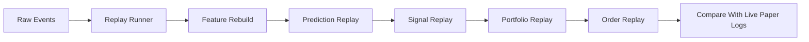

# Replay And Recovery

## 1. 목적

이 문서는 시스템 재시작, WebSocket 끊김, 장후 검증을 안정적으로 처리하기 위한 `복구`와 `리플레이` 기준을 정의합니다.

핵심 이유:

1. 실시간 시스템은 반드시 끊깁니다.
2. 복구 직후 바로 주문하면 위험합니다.
3. 같은 raw 데이터를 다시 재생해봐야 live 결과를 검증할 수 있습니다.

## 2. Recovery 와 Replay 의 차이

### Recovery

- 운영 중단 후 정상 상태로 돌아오는 절차

예:

- 토큰 재발급
- WebSocket 재연결
- 미체결 주문 동기화
- 포지션 복원

### Replay

- 저장된 raw 데이터를 시간 순서대로 다시 흘려보내며 예측/신호/주문 결과를 재생성하는 절차

예:

- 장후 특정 시점 재생
- 이상 주문 발생 구간 재현
- 모델 변경 전후 회귀 검증

## 3. 앱 시작 시 워밍업 절차

자동 주문 가능 상태로 들어가기 전 아래 순서를 거칩니다.

1. 설정 검증
2. REST 토큰 확인
3. WebSocket 접속키 준비
4. 최근 분봉 백필
5. 최근 호가/현재가 상태 확보
6. 브로커 잔고/미체결/체결 이력 동기화
7. 최근 특징 스냅샷 복원
8. 실시간 구독 시작
9. 준비 완료 확인 후에만 신규 주문 허용

이 과정을 `warm-up complete` 전에는 주문 금지 상태로 유지해야 합니다.

## 4. 장중 장애 유형

### A. WebSocket 종료

- 시세 수신 중단
- 재연결 필요

### B. REST 인증 만료

- 보조 조회/주문 실패
- 토큰 갱신 필요

### C. 프로세스 재시작

- 메모리 상태 유실
- 포지션/주문 재조정 필요

### D. 데이터 지연

- 시세는 오지만 늦게 도착
- 신규 주문 금지 필요

## 5. Recovery 정책

### WebSocket 재연결

1. 연결 종료 감지
2. 신규 주문 즉시 차단
3. 백오프 후 재연결
4. 구독 복원
5. 최근 수신 시각 정상화 확인
6. 정상화 후 신규 주문 재허용

### 프로세스 재시작

1. 브로커 상태 조회
2. 내부 주문/포지션 상태 로드
3. 차이 항목 `recovery_pending` 등록
4. 최근 시장 데이터 워밍업
5. 준비 완료 후 운용 재개

## 6. Replay 유형

### Event Replay

- raw tick / orderbook / event 데이터 재생

### Decision Replay

- 저장된 feature snapshot 기준으로 예측과 신호만 재실행

### Full Trading Replay

- raw 데이터부터 예측, 신호, 포트폴리오, 주문까지 전부 재실행

초기에는 `Decision Replay`와 `장후 Full Trading Replay` 중심으로 가는 것이 현실적입니다.

## 7. Replay 입력 단위

초기 권장 입력은 아래와 같습니다.

- `raw.market_ticks`
- `raw.orderbook_ticks`
- `curated.market_events`
- `feature.model_inputs`
- `serving.predictions`
- `serving.trade_signals`

## 8. 장후 리플레이 검증 흐름

## 9. 현재 권장 리플레이 사용처

1. 장후 일일 검증
2. 이상 주문 발생 구간 분석
3. 모델 버전 교체 전 회귀 검증
4. 신호 정책 변경 전 비교 실험

## 10. Recovery 와 Replay 에서 꼭 막아야 하는 것

1. 워밍업 완료 전 신규 주문
2. 재연결 직후 중복 주문
3. replay 결과를 live 결과와 혼동하는 것
4. live 상태 복원 없이 메모리 상태만 믿는 것

## 11. 초기 구현 단계 제안

### 1단계

- WebSocket 재연결
- warm-up 완료 전 주문 차단
- 앱 시작 시 포지션/미체결 동기화

### 2단계

- 장후 decision replay
- mismatch 로그 생성

### 3단계

- full trading replay
- 특정 구간 수동 재생 도구

## 12. 필요한 추가 저장 항목

replay를 위해 최소 아래가 필요합니다.

1. raw 이벤트 원본
2. feature snapshot
3. prediction log
4. signal log
5. order/position log
6. reconciliation 결과

## 13. 현재 구조에 필요한 추가 모듈

- `warmup manager`
- `replay runner`
- `market state restorer`
- `subscription restorer`
- `recovery gate`

## 14. 체크리스트

1. 앱 시작 시 반드시 warm-up 상태 표시
2. 장애 발생 시 신규 주문 자동 차단
3. 장후 replay 자동 실행
4. live/replay 차이 보고서 저장
